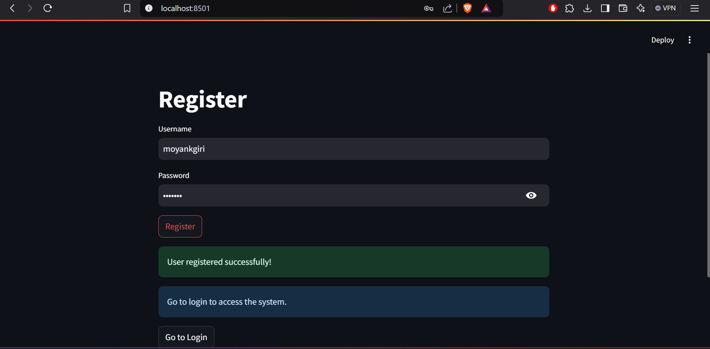

# Key Account Manager (KAM) Lead Management System

## 1. Project Overview
This project is a modular web application for "Key Account Manager (KAM) Lead Management System" that combines **FastAPI** for backend API management and **Streamlit** for frontend visualization. It offers user authentication, lead management, performance tracking, and interaction handling, making it a robust solution for data-driven decision-making.  

> **Note:** `ComplianceDocument.pdf` is also provided in the zip file which answers all questions and requirements posed in the Problem Statement Document

### Features:
- **Secure Authentication**: JWT-based token system.
- **Data Visualization**: Interactive dashboards with Streamlit.
- **Extensibility**: Modular design to easily add new APIs or features.
- **Dockerized Deployment**: Simplifies setup and ensures consistency.

### Database ER Diagram
The following ER diagram represents the database structure and schema


---

## 2. System Requirements
- **Python**: 3.9 or above
- **Docker**: 20.10 or above
- **Docker Compose**: 1.29 or above
- **FastAPI**: Version specified in [`fastapi/requirements.txt`](./fastapi/requirements.txt)
- **Streamlit**: Version specified in [`streamlit/requirements.txt`](./streamlit/requirements.txt)
- **jq library on Linux**: Latest Version for testing using test script
---

## 3. Installation Instructions

1. Clone/ Download the codebase

2. Run the build script to build the containers and populate the database with sample data:
   ```bash
   ./build.sh
   ```

---

## 4. Running Instructions

### Backend (FastAPI)
- The FastAPI service runs at `http://localhost:8000`.
- To explore the API documentation, visit `http://localhost:8000/docs` or `http://localhost:8000/redoc`.

### Frontend (Streamlit)
- The Streamlit app runs at `http://localhost:8501` and can be interacted with freely.

---

## 5. Test Execution Guide

1. For testing:
   > Note: For testing the endpoints using the script, ensure you have `jq` installed on your system for JSON parsing

   - Used **cURL** tool to test API endpoints using the `test_enpoints.sh`
   ```bash
    ./test_enpoints.sh
   ```
   - Visit the Streamlit app for frontend interaction.

---

## 6. API Documentation
The API includes the following endpoints:

- **Authentication**:
  - `POST /auth/register`: Register User.
  - `POST /auth/login`: Login User.
  - `GET /auth/me`: Get Current User.

- **Leads Management**:
  - `POST /leads/`: Create Lead.
  - `GET /leads/`: Get All Leads.
  - `GET /leads/due_today`: Get Due Calls Today.
  - `GET /leads/{lead_id}`: Get Lead.
  - `PUT /leads/{lead_id}`: Update Lead.
  - `DELETE /leads/{lead_id}`: Delete Lead.

- **POCs (Points of Contact)**:
  - `POST /pocs/`: Create Poc.
  - `GET /pocs/`: Get All Pocs.
  - `GET /pocs/{poc_id}`: Get Poc.
  - `DELETE /pocs/{poc_id}`: Delete Poc.

- **Interactions**:
  - `POST /interactions/`: Create Interaction.
  - `GET /interactions/`: Get All Interactions.
  - `GET /interactions/{lead_id}`: Get Interaction.

- **Performance**:
  - `POST /performance/recalculate`: Recalculate Metrics.
  - `GET /performance/well_performing`: Get Well Performing Accounts.
  - `GET /performance/underperforming`: Get Underperforming Accounts.
  - `GET /performance/{lead_id}`: Get Performance Metrics.
  - `PUT /performance/{lead_id}`: Update Performance Metrics.

Refer to the [Local FastAPI documentation](http://localhost:8000/docs) for detailed specifications.

---

## 7. Sample usage examples

a. Registration example can be seen in below attached screenshot


Other usage examples can be seen in the Demo Video

---
## 8. Project Structure

```plaintext
├── README.md                          # Project documentation file.
├── README_tmp.html                    # Temporary HTML version of README.
├── artifacts                          # Directory for project artifacts.
│   └── udaan_erdiagram.png            # Entity-relationship diagram.
├── build.sh                           # Shell script for building the project.
├── database                           # Directory containing database files.
│   └── createdatabase.sql             # SQL script to create the database.
├── docker-compose.yml                 # Docker Compose configuration file.
├── fastapi                            # Directory for the FastAPI application.
│   ├── Dockerfile                     # Dockerfile for FastAPI.
│   ├── app                            # FastAPI application code.
│   │   ├── auth                       # Directory for authentication-related files.
│   │   │   ├── auth.py                # Authentication logic for FastAPI.
│   │   │   └── jwt.py                 # JWT token generation and validation.
│   │   ├── crud.py                    # CRUD operations for FastAPI.
│   │   ├── database.py                # Database connection and management logic.
│   │   ├── main.py                    # Main FastAPI application entry point.
│   │   ├── models.py                  # Data models for FastAPI.
│   │   ├── routers                    # Directory for route handlers.
│   │   │   ├── interactions.py        # Interactions endpoint logic.
│   │   │   ├── leads.py               # Leads management endpoint logic.
│   │   │   ├── performance.py         # Performance tracking endpoint logic.
│   │   │   └── pocs.py                # POCs management endpoint logic.
│   │   └── schemas.py                 # Data validation schemas for FastAPI.
│   └── requirements.txt               # Required Python packages for FastAPI.
├── streamlit                          # Directory for the Streamlit app.
│   ├── Dockerfile                     # Dockerfile for Streamlit app.
│   ├── api.py                         # API interaction logic for Streamlit app.
│   ├── app.py                         # Main Streamlit application entry point.
│   └── requirements.txt               # Required Python packages for Streamlit.
└── test_endpoints.sh                  # Shell script to test FastAPI endpoints.
```

- **`fastapi/app/auth`**: Manages user authentication, including JWT creation and validation.
- **`fastapi/app/routers`**: Contains modular API routers for managing leads, performance data, and more.
- **`streamlit/`**: Interactive User Interface.

---

## 9. Interesting Techniques
1. **JWT Authentication**: Secure token-based authentication in [`auth/jwt.py`](./fastapi/app/auth/jwt.py).
2. **ORM Models**: Database abstraction using Pydantic and SQLAlchemy in [`models.py`](./fastapi/app/models.py).
3. **Dynamic API Routing**: Modularized routers for scalability in [`routers`](./fastapi/app/routers).
4. **Background Tasks**: Lightweight background tasks for recalculating performance metrics.
5. **Componentized Frontend**: Modular Streamlit UI with reusable functions for forms and lists.
6. **SQLAlchemy Expressions**: Efficient calculation of due calls and performance metrics using dynamic ORM queries.

---